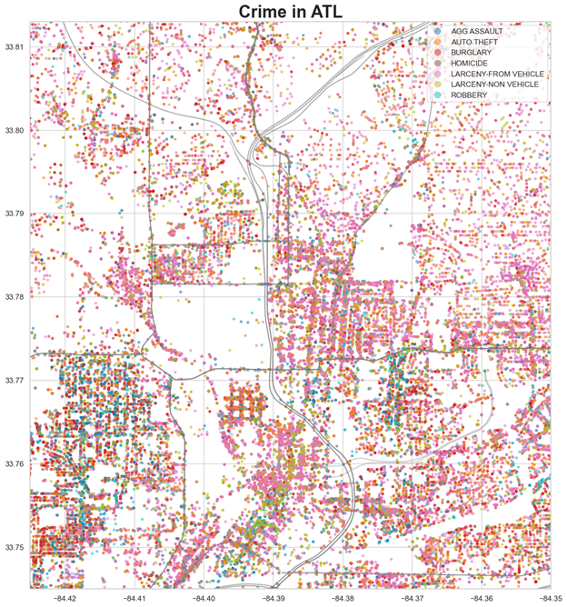
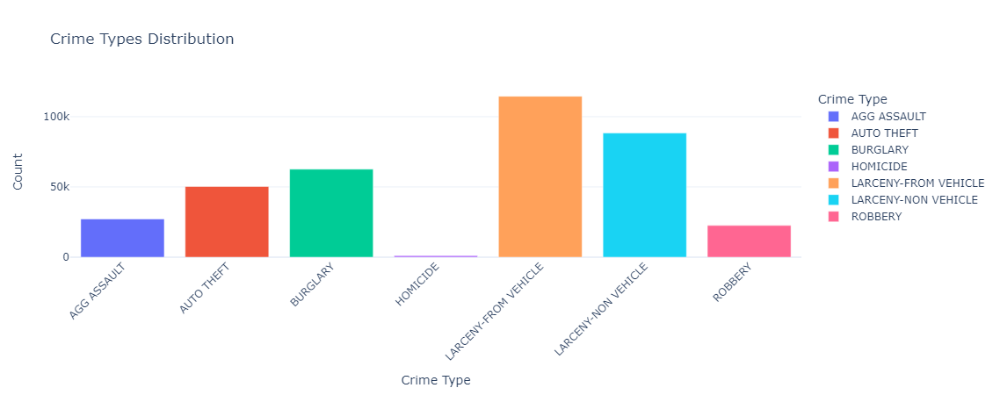
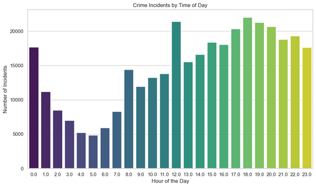
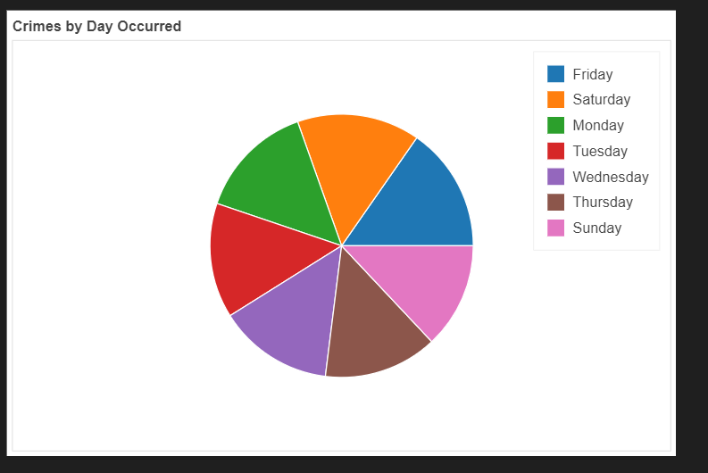
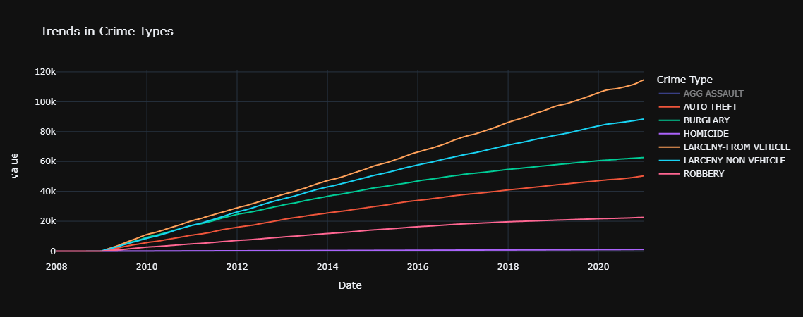
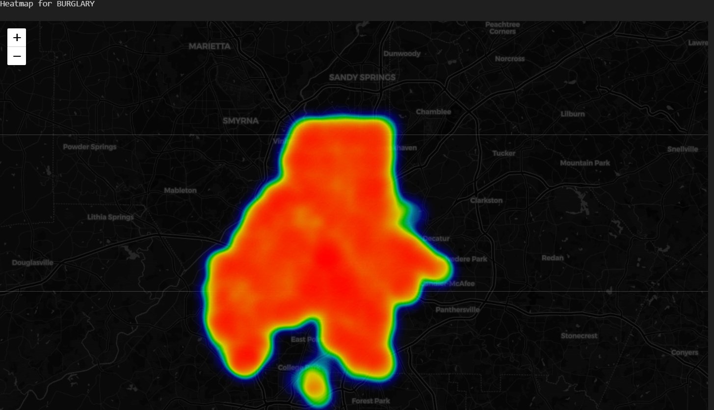
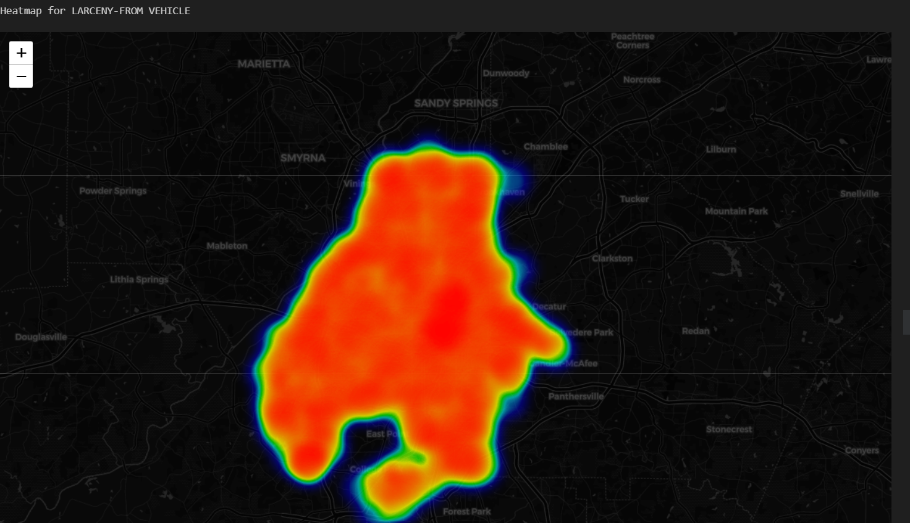
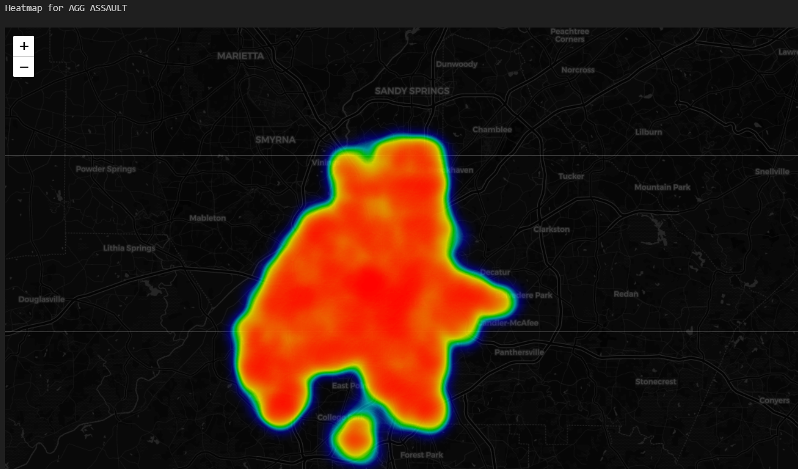
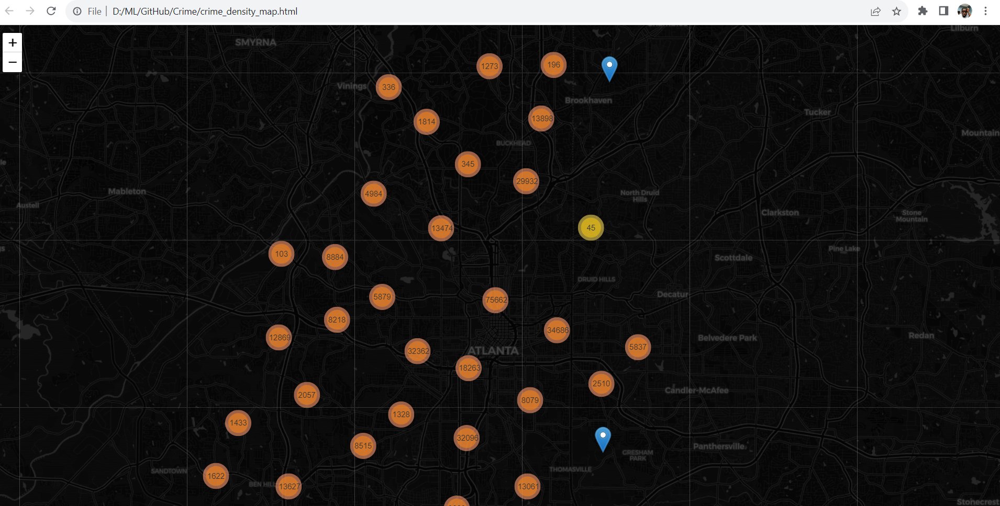

# Atlanta Crime Analysis


Welcome to the **Atlanta Crime Analysis** repository! This project focuses on performing geospatial analysis of the Atlanta Police Department's crime data spanning from 2009 to 2020. Through data visualization, exploration, and interpretation, we aim to gain insights into crime trends, hotspots, and patterns within the city of Atlanta.

## Table of Contents

- [Introduction](#introduction)
- [Motivation](#Motivation)
- [Data](#data)
- [Analysis](#analysis)
- [Plot Samples](#Plots)
- [Usage](#usage)
- [Contributing](#contributing)
- [License](#license)

## Introduction

Crime analysis is a crucial aspect of maintaining public safety. This project seeks to leverage geospatial analysis techniques to provide a better understanding of crime occurrences in Atlanta. By visualizing the data on maps and charts, we aim to uncover meaningful patterns that could aid law enforcement agencies, policymakers, and the community in making informed decisions.

## Motivation

As someone who enjoys crime movies, this project was an exciting opportunity to translate that fascination into a real-world analysis. Combining my passion for crime narratives with the power of Python and geospatial techniques allowed me to step into the shoes of movie geniuses and explore crime data from a fresh perspective.

In crime movies, we're often captivated by the brilliant minds that analyze complex patterns and piece together clues to solve mysteries. This project was my chance to be that detective, deciphering the enigmatic patterns hidden within the crime data. The process of data transformation, geospatial visualization, and temporal exploration mirrored the suspenseful pacing of a cinematic thriller. With each insight uncovered, I felt a sense of accomplishment akin to the 'Eureka!' moment in movies.

In a way, this project allowed me to live out the excitement of crime-solving adventures I've watched on screen. From unraveling intricate webs of criminal activities to visualizing crime hotspots on maps, every step felt like a scene from a gripping plot. The outputs of this analysis weren't just visualizations; they were the thrilling outcomes of my detective journey into the world of crime data.

By merging my love for movies with the realm of data science, this project has provided a unique and engaging experience. It's not every day that one gets to combine their hobbies with their skillset, and the results have been nothing short of captivating. Just like a crime movie, this project is a story of exploration, discovery, and the pursuit of insight—making it a truly rewarding endeavor.


## Data

The primary dataset used in this project is the Atlanta Police Department's crime data. This dataset contains records of various types of crimes, their locations, dates, and other relevant information. The dataset covers a span of over a decade, allowing us to identify trends and patterns that have emerged over the years.
The dataset can be downloaded at [https://www.atlantapd.org/i-want-to/crime-data-downloads]

## Analysis

Our analysis involves various stages, including:

1. Data Preprocessing: Cleaning, transforming, and organizing the raw data into a suitable format for analysis.
2. Geospatial Visualization: Plotting crime incidents on maps to identify crime hotspots, trends, and areas of concern.
3. Temporal Analysis: Studying how crime rates vary across different time periods, such as months, days of the week, and hours of the day **Time series**.
4. Crime Types: Exploring the distribution of different crime types to identify prevalent and emerging criminal activities.

## Plots

Here are some sample plots generated from the analysis:

1. **An Overview of all crimes**
    

2. **A bar plot showing the distribution of crime type in Atlanta**
   

3. **Distribution of crimes per time of the day**
   

4. **Pie Chart showing relatively even distribution of crimes per each day of the week**
   

5. **Trends in crime type from 2009-2020**
   

6. **Heat Map for Burglaries**
   

7. **Heat Map for Vehicle Larcenies**
   

8. **Heat Map for Robberies**
   

9. **Final Density Map**
    - [Download the Interactive Density Map](https://drive.google.com/file/d/1VS1V2_8RFwI-s8gZFoJkBvHcHCUFsDwU/view?usp=drive_link)



## Usage

**The final product of this project is an interactive density map that highlights crime hotspots within the city of Atlanta.** Due to its file size, I've provided a download link for the map:

- [Download the Interactive Density Map](https://drive.google.com/file/d/1VS1V2_8RFwI-s8gZFoJkBvHcHCUFsDwU/view?usp=drive_link)

To explore the analysis and findings of this project, you can:

1. Clone the repository:
   ```bash
   git clone https://github.com/JosephGyegyiri/Atlanta-Crime-Analysis.git


## Contributing
Contributions are welcome and encouraged! If you want to contribute to this project, here's how:

1. Fork the repository.
2. Create a new branch for your feature or bug fix.
3. Make your changes and enhancements.
4. Open a pull request, describing the changes you've made.
